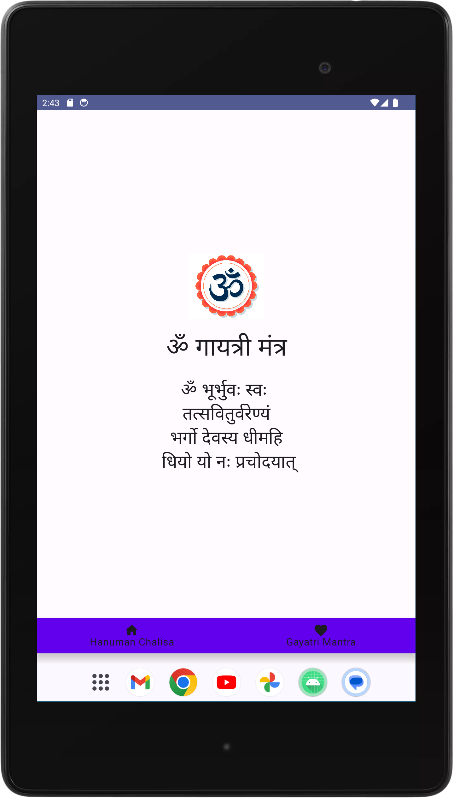

# Mantra App

The /Mantra App provides a seamless experience for reading and reciting the Hanuman Chalisa and Gayatri Mantra. It features a user-friendly interface with options to switch between Hindi and Hindglish text and includes navigation to different sections of the app.

## Features

- **Hanuman Chalisa: Read the Hanuman Chalisa in Hindi and Hindglish.**
- **Gayatri Mantra: Recite the Gayatri Mantra with a dedicated screen.**
- **Navigation: Easily switch between the Hanuman Chalisa and Gayatri Mantra using a bottom navigation bar.**

## Screenshots

<!-- Images displayed side by side -->
<div style="display: flex; gap: 20px; justify-content: center;">
    
    
</div>

## Video Demo

<!-- Embed a video file from the images folder -->
<p align="center">
    
</p>

## Getting Started

### Prerequisites

- Android Studio (latest version recommended)
- Kotlin (as the primary programming language)
- Jetpack Compose (for UI components)

### Installation

1. **Clone the repository:**
   ```bash
   git clone https://github.com/your-username/HanumanChalisaApp.git

2.  **Open the project in Android Studio:**
   
- Launch Android Studio.
- Select "Open an existing Android Studio project" and navigate to the cloned repository.

3. Add Dependencies

**Ensure that you have the required dependencies in your build.gradle file:**

```
dependencies {
    implementation "androidx.compose.ui:ui:1.5.0"
    implementation "androidx.compose.material3:material3:1.2.0"
    implementation "androidx.navigation:navigation-compose:2.6.0"
    implementation "io.coil-kt:coil-compose:2.4.0"
}
```

**Sync the Project**
**Click "Sync Now" in Android Studio to ensure all dependencies are downloaded.**
  
4. **Build and Run:**
   
- Click on the "Build" menu and select "Rebuild Project".
- Click on the "Run" button to launch the app on an emulator or connected device.

### Contributing
Feel free to submit issues or pull requests. Contributions are welcome!

### How to Contribute
- Fork the repository and create a new branch.
- Make your changes and commit them.
- Push your changes to your fork.
- Create a pull request to the main repository.
  
### License
This project is licensed under the MIT License - see the [LICENSE](LICENSE)
 file for details.

### Acknowledgments
- Jetpack Compose for modern Android UI toolkit.
- Coil for image loading.
- Material Design for UI components.

**For any questions or support, please contact chandandutta168@gmail.com.**
