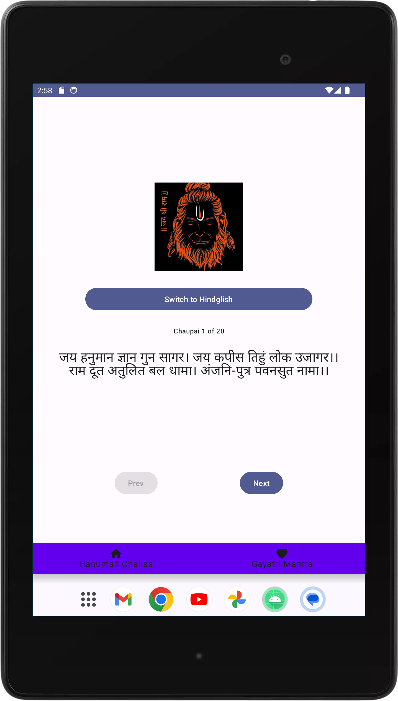

# Hanuman Chalisa App

A modern Compose-based Android app for displaying Hanuman Chalisa in Hindi and Hinglish. This app features a toggle button to switch between the Hindi and Hinglish versions and a simple navigation system to browse through different Chaupais.

## Features

- **Toggle between Hindi and Hinglish:** Switch between the original Hindi text and its Hindglish transliteration.
- **View Hanuman Chalisa:** Display Hanuman Chalisa with navigation controls.
- **User-friendly Navigation:** Navigate through the Chaupais with 'Next' and 'Previous' buttons.
- **Centered Image and Text:** Visual layout with a centered image and text.

## Screenshots

<!-- Images displayed side by side -->
<div style="display: flex; gap: 20px; justify-content: center;">
    
    
</div>

## Video Demo

<!-- Embed a video file from the images folder -->
<p align="center">
    
</p>

## Getting Started

### Prerequisites

- Android Studio (latest version recommended)
- Kotlin (as the primary programming language)
- Jetpack Compose (for UI components)

### Installation

1. **Clone the repository:**
   ```bash
   git clone https://github.com/your-username/HanumanChalisaApp.git

2.  **Open the project in Android Studio:**
   
- Launch Android Studio.
- Select "Open an existing Android Studio project" and navigate to the cloned repository.

3. **Build and Run:**
   
- Click on the "Build" menu and select "Rebuild Project".
- Click on the "Run" button to launch the app on an emulator or connected device.

### Contributing
Feel free to submit issues or pull requests. Contributions are welcome!

### How to Contribute
- Fork the repository and create a new branch.
- Make your changes and commit them.
- Push your changes to your fork.
- Create a pull request to the main repository.
  
### License
This project is licensed under the MIT License - see the [LICENSE](LICENSE)
 file for details.

###Acknowledgments
-Jetpack Compose for modern Android UI toolkit.
-Coil for image loading.
-Material Design for UI components.

**For any questions or support, please contact chandandutta168@gmail.com.**
